# Agiloft Contract Dashboards Skill — allneurons

> **Draft B of two.** Draft A is the structured version in [README.md](./README.md), which is what GitHub renders by default. Pick one and delete the other.

Ask a contract question in plain English. Get an answer with its source, and a
live four-tab dashboard beside the chat — without opening Agiloft.

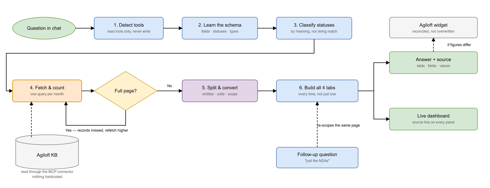

*Solid arrows are the path every question takes. Dashed arrows are conditional — the
knowledgebase read, a follow-up re-scoping the page in place, and the Agiloft widget
figure, which appears only when it differs from ours.*

## Prerequisites

- [Download the skill](../../dist/agiloft-contracts.skill)
- **To install:** download the file above, then add it in Claude Desktop under **Settings → Skills**. Restart Claude fully afterwards.
- **An Agiloft MCP connector installed and connected.** This skill reads contract data through it and does not connect to Agiloft on its own. Check Settings → Connectors for `agiloft`, or run `claude` then `/mcp`.
- **Claude Cowork**, on a Pro, Team or Enterprise plan.

**Check the connector is on.** In Cowork, the **+** menu → **Connectors**, with `agiloft` toggled on:

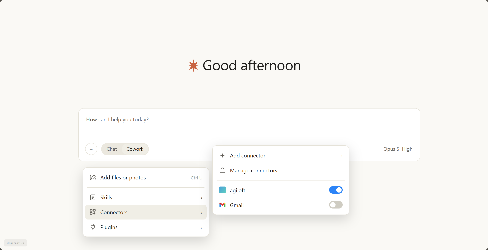

**Check the skill is added.** Settings → Skills → **Add**, then drop in the `.skill` file. It goes through a short security scan before it is ready:

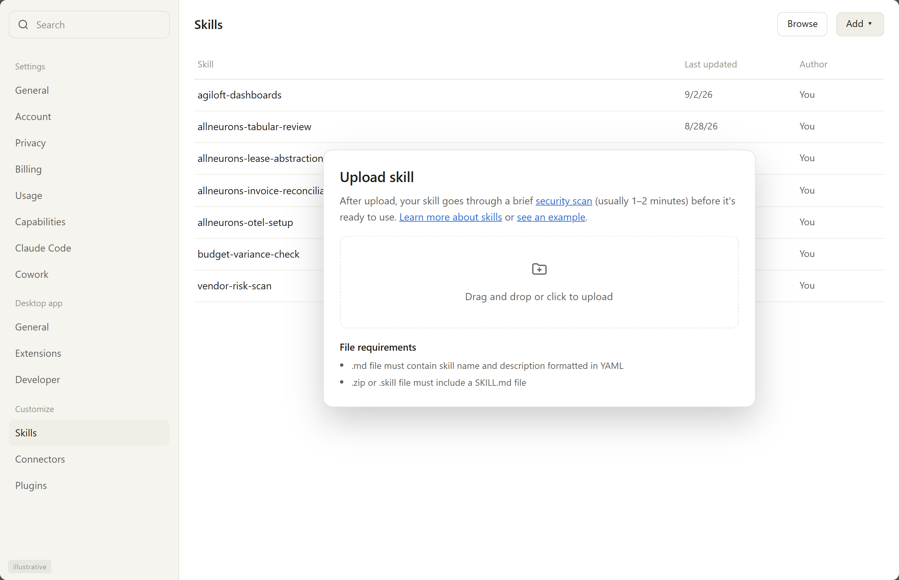

An Agiloft login on its own is not enough — the connector is a separate piece, usually maintained by whoever administers Agiloft for your team. If it isn't installed yet, ask them for their setup guide; some deployments also require an endpoint-security exception before it will run.

The skill works with any Agiloft CLM knowledgebase. It does not assume your status names, agreement types or field names — it discovers them at the start of each session.

## Who sees what

The connector authenticates as **one Agiloft account**, and Agiloft applies that account's permissions to everything the skill reads. The dashboard shows that account's view of the knowledgebase, not the whole thing.

Two consequences worth knowing before you roll this out:

- **Two people can ask the same question and get different numbers, and both be right** — if the connector runs on their own seats and those seats have different visibility.
- **A shared service account gives everyone the same view**, which is usually a wider one than the person reading the screen would have in Agiloft. That is a deliberate decision to make, not a detail to discover later.

The skill puts the account it is reading as into the dashboard header, so anyone looking at a screenshot knows whose view it is.

## How to run the skill

1. **Go to Claude Cowork.**
2. **Invoke the skill** — make sure you've added it first (see Prerequisites). No setup form, no configuration folder. If the `agiloft` connector is live, the skill is ready.
3. **Ask a question in plain English.** Anything about contracts — how many are in flight, what's expiring, whether a company has an NDA, what's slowing things down.

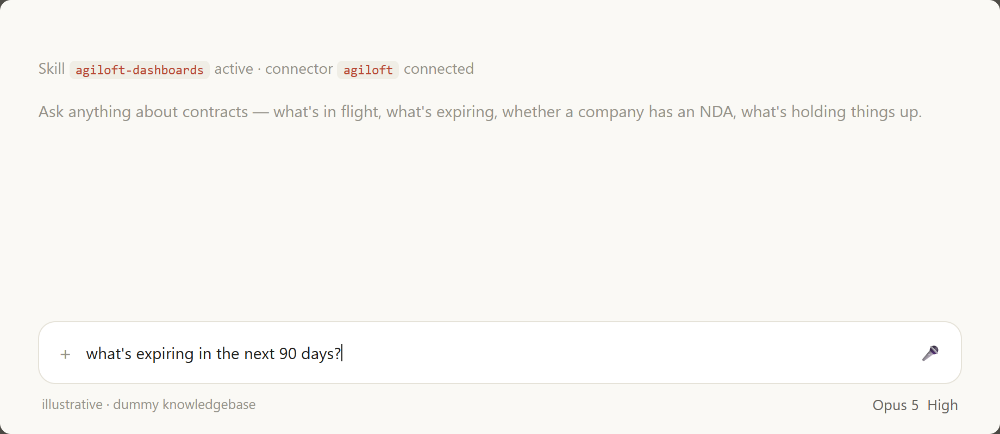

4. **Read the answer in chat.** The figure, what it means, and where in Agiloft it came from. Length follows the question: a count is a sentence, a bottleneck is a short paragraph.

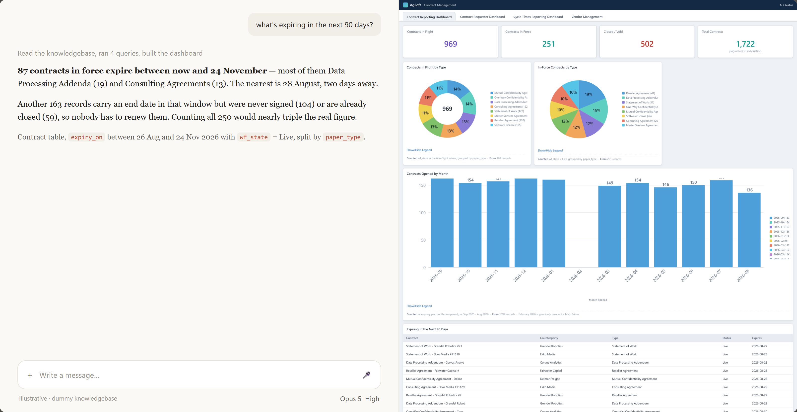

5. **Open the dashboard beside the chat.** Four tabs — Contract Reporting, Contract Requester, Cycle Times Reporting, Vendor Management — populated with live data. All four are built every time; the one that answers your question is the one that opens.

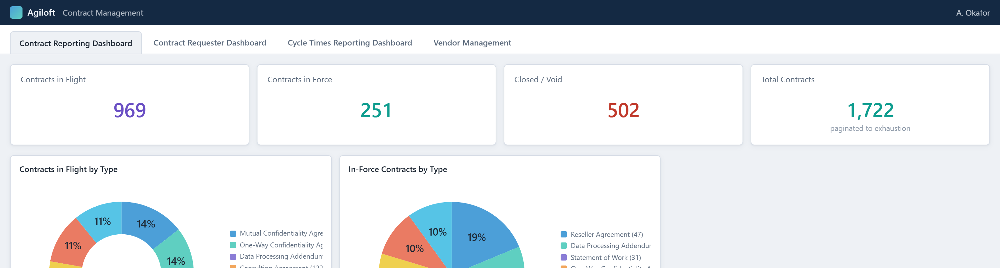

6. **Follow up.** "Just the NDAs", "who owns those", "what about last quarter" — the same dashboard re-scopes in place rather than a second one appearing.

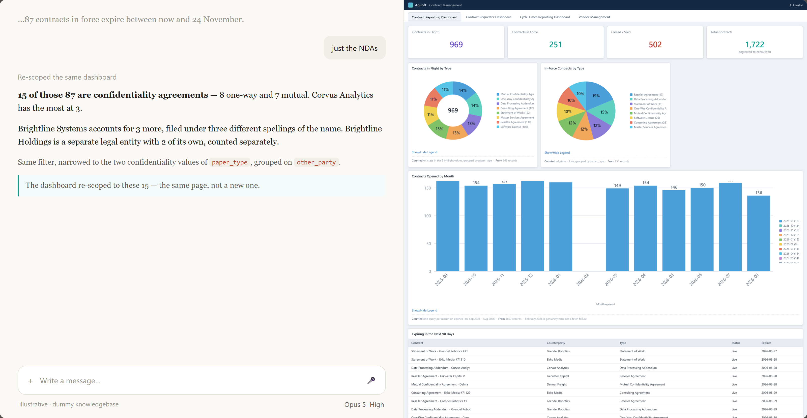

7. **Check any number against Agiloft.** Every panel carries a source line saying what was counted and, where an Agiloft widget covers the same ground, that widget's number alongside.

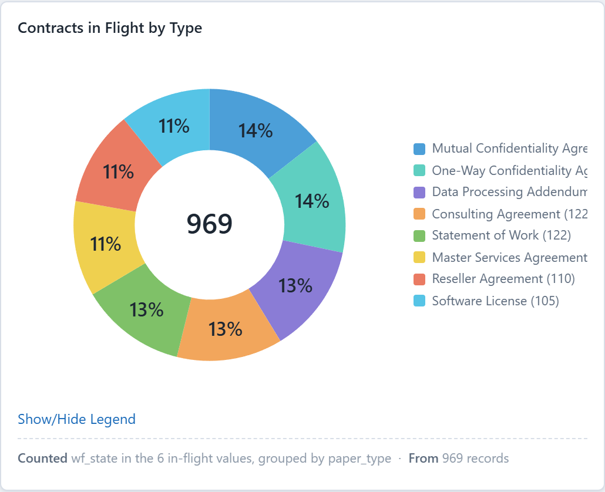

> The dashboard images are real renders against a dummy knowledgebase — every
> counterparty in them is invented. The Claude Desktop frames around them, and the
> two Settings images above, are illustrative and tagged as such; they are replaced
> with live captures once a session is available.

## The problem this skill solves

Legal, Legal Ops and business requesters all need the same handful of answers from Agiloft — is there an NDA with this company, what's expiring, where has my request got to, what's holding things up. Today that means logging into Agiloft, finding the right dashboard, applying the right filter, and reading a report designed for someone else.

Most of the people asking aren't Agiloft users. They ask a paralegal, who stops what they're doing and goes and looks. The lookup takes a minute; the interruption costs far more, and it happens many times a day.

Underneath that sits the harder problem: several of these questions are easy to answer *wrongly* in ways that look right. Most of this skill is not about fetching data. It is a set of rules about the specific ways a contract number goes wrong.

## Benefits of using this skill

- **Complete answers, not walls of text.** The figure, what it means, and where it came from. No fixed length and no padding — and never two percentages handed over for the reader to compare themselves.
- **Every number shows its source.** Not "from Agiloft" — the table, the fields filtered on, and the values used, so anyone can reproduce the figure in Agiloft and settle a disagreement about it.
- **Adapts to your knowledgebase.** Status names, agreement types and field names are discovered at runtime, not hardcoded. Nothing assumes a particular Agiloft configuration.
- **Familiar layout.** Four dashboards that map to how most Agiloft CLM teams already split their reporting, so nobody has to learn a new report.
- **Similarly-named companies stay separate.** Counterparty search is deliberately loose, because names are filed inconsistently — but results are split back out by entity before anything is counted, so *ABC Systems* and *ABC Holdings* never merge into one answer.
- **Reconciles against Agiloft rather than competing with it.** "Expiring" can mean contracts in force, or every record with an end date. The skill says which it counted and reports the other figure alongside; a difference it cannot explain is stated, not quietly adjusted away.
- **Read-only.** The connector can create, update and delete contract records. This skill never calls those tools and refuses requests to change anything.
- **Nothing invented, nothing fake.** A field the record doesn't hold is reported as missing rather than filled with plausible prose. A panel with no data says so. No dead links and no "click to drill down" on a static page.

## Output

Two things, delivered together.

**An answer in chat** — for example: *"87 contracts in force expire in the next 90 days, most of them Data Processing Addenda and Consulting Agreements. Another 163 records carry an end date in that window but were never signed or are already cancelled, so they aren't renewals anyone has to action — Contract table, `end_date` in the next 90 days, split by `status`."*

**A live dashboard beside the chat**, with four tabs:

1. **Contract Reporting** — totals for contracts in flight, in force, closed and overall; the mix by agreement type; month-by-month volumes; and what's expiring in the next 90 days.

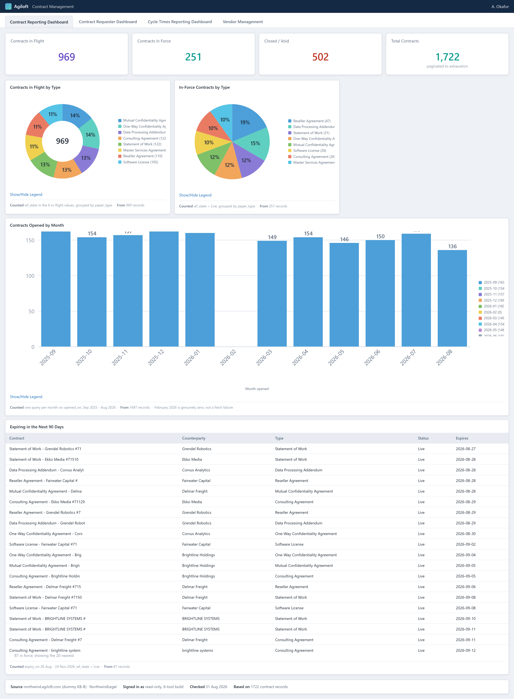

2. **Contract Requester** — scoped to you. Your drafts, contracts in progress, anything expiring within 30 and 90 days, and a table of your contracts with dates, counterparty and status.

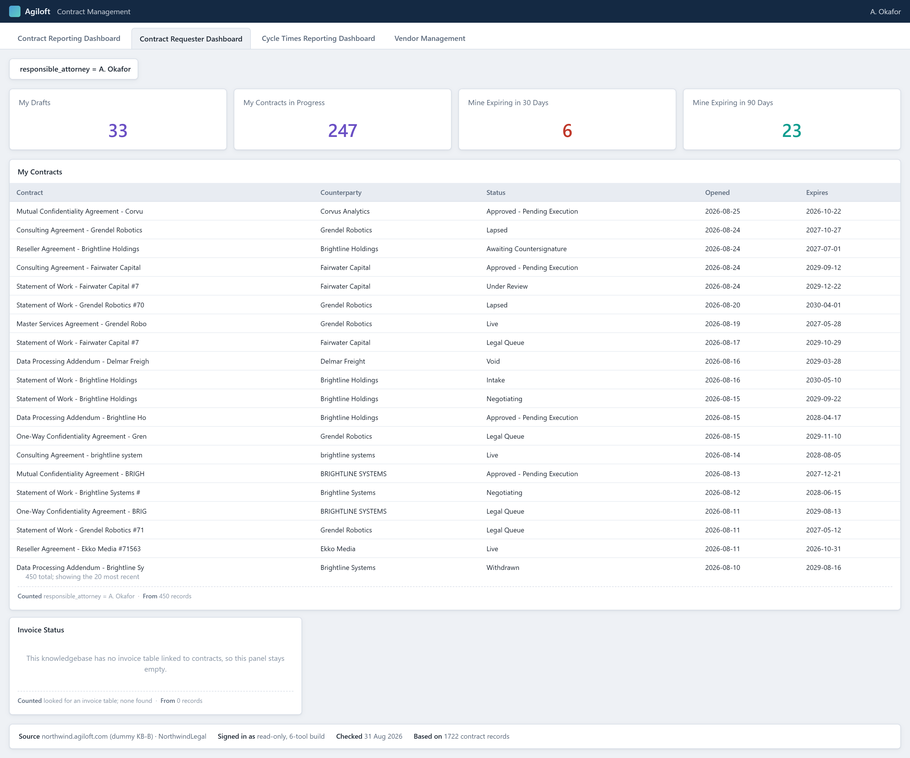

3. **Cycle Times Reporting** — how long in-flight contracts have been sitting in their current status, banded and broken down by stage and agreement type. Contracts with no age recorded are shown as their own band rather than dropped. Requires an ageing field in your knowledgebase; if there isn't one, the skill says so rather than estimating.

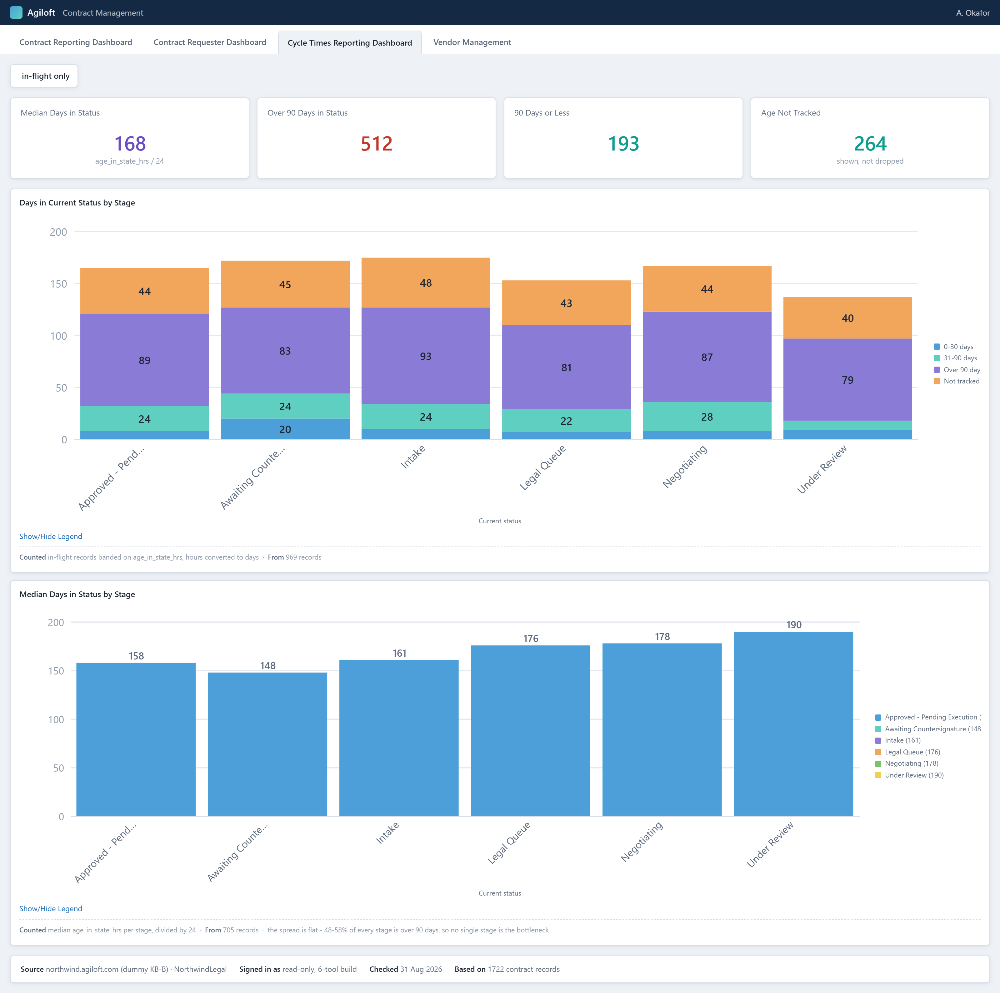

4. **Vendor Management** — active vendors counted as distinct counterparties, vendor agreements by lifecycle state, and a twelve-month view of upcoming renewals.

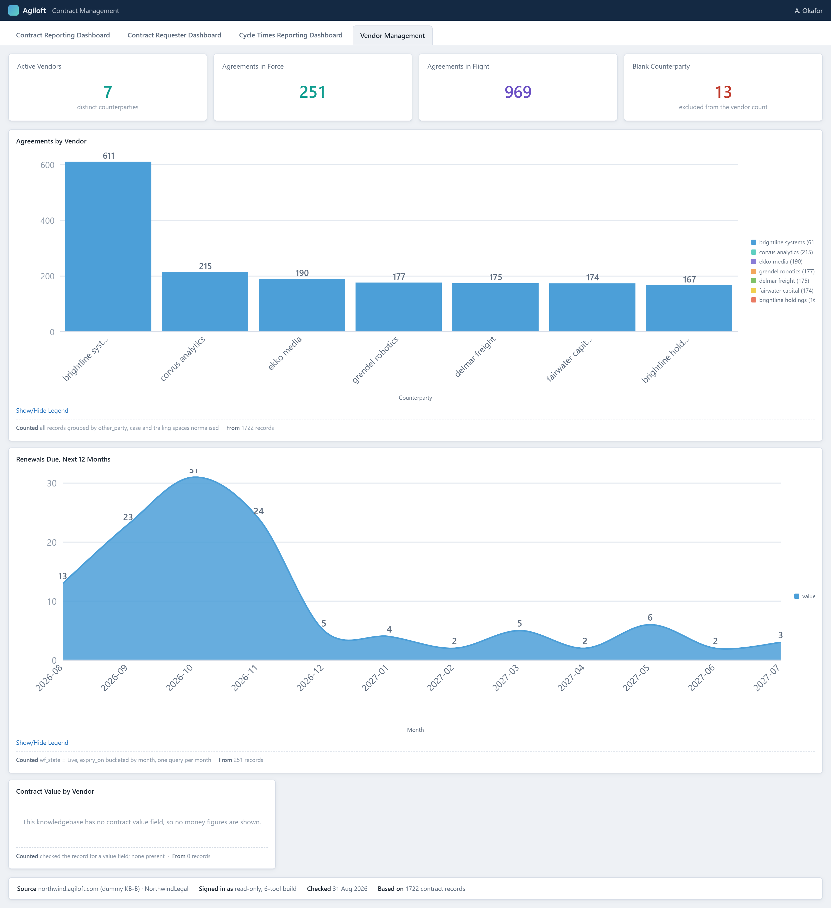

The dashboard is self-contained HTML and updates in place as the conversation narrows — ask a follow-up and the same page re-scopes rather than a new one appearing.

## How the skill works behind the scenes

**At a high level:** the skill reads Agiloft through the MCP connector, works out the answer itself, and writes the result into a self-contained HTML dashboard. There is no configuration file and no setup step — the connector is the only dependency.

The full sequence:

1. **Detect which connector build is present.** Some expose three read tools, others add aggregation tools on top. The skill uses whichever is there and never calls the create, update or delete tools.
2. **Learn the knowledgebase.** One record read gives the real field names, which differ from the labels shown in the UI. The status values and agreement types in use are read either through the aggregation tools or, on a read-only build, by paging the contract table once and counting. Everything after this works from what was found, not from assumptions.
3. **Classify the statuses by meaning, not by string match.** `Lapsed` is Expired, `Void` is Cancelled, `Live` is Active. Where a status is genuinely ambiguous, the skill says which way it counted. It also establishes whose view this is — a zero result is reported as "none I can see", not "none exist".
4. **Read the question, not just the topic.** "How many" returns a number; "what are" and "which" return records as a table. A count is an addition to a list, never a substitute for one.
5. **Fetch, then check the fetch.** Every request is compared against the page limit it asked for. Equal means records were missed, so it refetches higher before that number goes anywhere. This is the most likely way a page size gets reported as a company total.
6. **Bound time ranges properly.** Anything "over the last N months" is queried one month at a time. Pulling recent records and grouping them makes early months look empty and invents a trend that isn't there.
7. **Search companies loosely, then split the results by entity.** Loose search prevents a false "no" on the NDA question; splitting the results back out by counterparty before counting prevents a false "yes" from a similarly-named company. Both halves are necessary.
8. **Check the unit on any duration field.** Some knowledgebases store days in current status, others store hours — 90 days is `90` in one and `2160` in the other. The skill converts for display and says which it used. Records with no age recorded stay in, as their own band; excluding them shifts every percentage on the chart.
9. **Answer single-contract questions from populated fields only.** The Agiloft record holds parties, dates, type, status and owner — not payment terms or liability caps, unless the knowledgebase runs Agiloft's **Extract Key Terms** action. The skill checks for those extracted fields, uses them where they exist and labels them as model-extracted rather than lawyer-entered, and otherwise states plainly what the record does not contain.
10. **Build all four dashboards and attach the source lines.** Every panel gets its filter in plain words, its record count, and the Agiloft widget it reconciles against where one exists. On a follow-up the same dashboard re-scopes — a dashboard showing company-wide figures while the chat discusses one vendor is how a wrong number gets screenshotted and forwarded.
