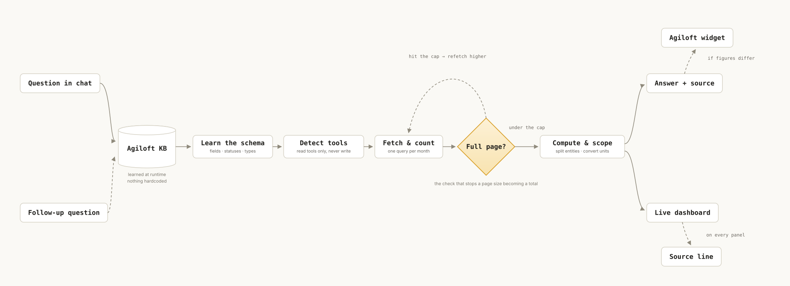

# Agiloft Contract Dashboards Skill — allneurons

*Solid lines run every time. Dashed lines are conditional — the refetch loop fires
only when a page comes back full, and the Agiloft widget figure appears only when it
differs from ours.*

## Prerequisites

- [Download the skill](../../dist/agiloft-contracts.skill)
- **To install:** download the file above, then add it in Claude Desktop under **Settings → Skills**, or unzip it into `~/.claude/skills/agiloft-contracts/`. Restart Claude fully afterwards.
- **An Agiloft MCP connector installed and connected.** This skill reads contract data through it and does not connect to Agiloft on its own. Check Settings → Connectors for `agiloft`, or run `claude` then `/mcp`.
- **Network access to your Agiloft instance** — a VPN connection if your deployment requires one.
- **Claude Cowork**, on a Pro, Team or Enterprise plan.

An Agiloft login on its own is not enough — the connector is a separate piece, usually maintained by whoever administers Agiloft for your team. If it isn't installed yet, ask them for their setup guide; some deployments also require an endpoint-security exception before it will run.

The skill works with any Agiloft CLM knowledgebase. It does not assume your status names, agreement types or field names — it discovers them at the start of each session.

## Who sees what

The connector authenticates as **one Agiloft account**, and Agiloft applies that account's permissions to everything the skill reads. The dashboard shows that account's view of the knowledgebase, not the whole thing.

Two consequences worth knowing before you roll this out:

- **Two people can ask the same question and get different numbers, and both be right** — if the connector runs on their own seats and those seats have different visibility.
- **A shared service account gives everyone the same view**, which is usually a wider one than the person reading the screen would have in Agiloft. That is a deliberate decision to make, not a detail to discover later.

The skill puts the account it is reading as into the dashboard header, so anyone looking at a screenshot knows whose view it is.

## How to run the skill

1. **Go to Claude Cowork.**
2. **Invoke the skill** — make sure you've added it first (see Prerequisites). No setup form, no configuration folder. If the `agiloft` connector is live, the skill is ready.
3. **Ask a question in plain English.** Anything about contracts — how many are in flight, what's expiring, whether a company has an NDA, what's slowing things down.

<!-- SCREENSHOT PENDING: 02-question.png -->

4. **Read the one-line answer in chat.** Short by design. The detail goes on the dashboard rather than into a wall of text.

<!-- SCREENSHOT PENDING: 03-answer.png -->

5. **Open the dashboard beside the chat.** Four tabs — Contract Reporting, Contract Requester, Cycle Times Reporting, Vendor Management — laid out the way they appear in Agiloft, populated with live data.

<!-- SCREENSHOT PENDING: 04-dashboard-tabs.png -->

6. **Follow up.** "Just the NDAs", "who owns those", "what about last quarter" — the same dashboard updates in place rather than a second one appearing.

<!-- SCREENSHOT PENDING: 05-followup.png -->

7. **Check any number against Agiloft.** Every panel carries a small source line saying what was counted and, where an Agiloft widget covers the same ground, that widget's number alongside.

<!-- SCREENSHOT PENDING: 06-source-line.png -->

> **Screenshots pending.** The walkthrough images are captured from a live run and
> are not in the repo yet — see `assets/SCREENSHOTS-NEEDED.md` for the list and the
> pre-publish privacy check. The placeholders are in the source as HTML comments,
> ready to re-enable once the files land.

## The problem this skill solves

Legal, Legal Ops and business requesters all need the same handful of answers from Agiloft — is there an NDA with this company, what's expiring, where has my request got to, what's holding things up. Today that means logging into Agiloft, finding the right dashboard, applying the right filter, and reading a report designed for someone else.

Most of the people asking aren't Agiloft users. They ask a paralegal, who stops what they're doing and goes and looks.

This skill answers those questions in a sentence, and puts the supporting detail on a dashboard that looks like the ones the team already knows — without anyone having to learn Agiloft's reporting.

## Benefits of using this skill

- **Answers in one line, not a wall of text.** The audience is contract requesters and business leads. The chat gives the number or the name; the dashboard carries the rest.
- **Familiar layout.** The four dashboards mirror the ones most Agiloft CLM deployments already have — Contract Reporting, Contract Requester, Cycle Times Reporting, Vendor Management — so nobody has to learn a new report.
- **Adapts to your knowledgebase.** Status names, agreement types and field names are discovered at runtime, not hardcoded. Nothing assumes a particular Agiloft configuration.
- **Every number shows where it came from.** Each panel prints the filter it used and how many records it rests on. Where an Agiloft widget answers the same question, its figure appears alongside and any difference is explained.
- **Reconciles against Agiloft rather than competing with it.** "Expiring" can mean contracts in force, or every record with an end date. The skill says which one it counted — a difference between the two is reported, not hidden.
- **Similarly-named companies stay separate.** Searching for a counterparty is deliberately loose, because names are filed inconsistently. But the results are split back out by entity before anything is counted, so *ABC Systems* and *ABC Holdings* never merge into one answer.
- **Read-only.** The connector can create, update and delete contract records. This skill never calls those tools and refuses requests to change anything.
- **No invented answers.** If a field isn't in the Agiloft record, the skill says so rather than producing a plausible-sounding paragraph. Contract summaries state what they were read from.
- **Nothing on the dashboard is fake.** No links that go nowhere, no "click to drill down" on a static page, no placeholder figures. A panel with no data says so.
- **Counts are checked, not assumed.** After every fetch the skill compares what came back against the page limit it asked for, so a page size never gets reported as a total.

## Output

Two things, delivered together.

**A short answer in chat** — one or two sentences, number or name first. For example: *"116 contracts in force expire in the next 90 days. Another 146 records carry an end date in that window but are unsigned or already cancelled."*

**A live dashboard beside the chat**, with four tabs:

1. **Contract Reporting** — totals for contracts in flight, in force, closed and overall; the mix by agreement type; month-by-month volumes; and what's expiring in the next 90 days.

<!-- SCREENSHOT PENDING: 07-reporting.png -->

2. **Contract Requester** — scoped to you. Your drafts, contracts in progress, anything expiring within 30 and 90 days, and a table of your contracts with dates, counterparty and status.

<!-- SCREENSHOT PENDING: 08-requester.png -->

3. **Cycle Times Reporting** — how long in-flight contracts have been sitting in their current status, banded and broken down by stage and agreement type. Contracts with no age recorded are shown as their own band rather than dropped. Requires an ageing field in your knowledgebase; if there isn't one, the skill says so rather than estimating.

<!-- SCREENSHOT PENDING: 09-cycle-times.png -->

4. **Vendor Management** — active vendors counted as distinct counterparties, vendor agreements by lifecycle state, and a twelve-month view of upcoming renewals.

<!-- SCREENSHOT PENDING: 10-vendor.png -->

The dashboard updates in place as the conversation narrows — ask a follow-up and the same page re-scopes rather than a new one appearing.

## How the skill works behind the scenes

**At a high level:** the skill reads Agiloft through the MCP connector, works out the answer itself, and writes the result into a self-contained HTML dashboard. There is no configuration file and no setup step — the connector is the only dependency. Most of the skill is not about fetching data but about the rules that stop a plausible-looking wrong number reaching a tile.

The full step-by-step:

1. **Detect which connector build is present.** Some expose three read tools, others add aggregation tools on top. The skill uses whichever is there and never calls the create, update or delete tools.
2. **Learn the knowledgebase.** One record read gives the real field names; the status values and agreement types in use are read either through the aggregation tools or, on a read-only build, by paging the contract table once and counting. Everything after this works from what was found, not from assumptions.
3. **Establish whose view this is.** The connector's account determines what is visible. That account goes in the dashboard header, and a zero result is reported as "none I can see" rather than "none exist".
4. **Read the question, not just the topic.** "How many" returns a number; "what are" and "which" return records as a table. A count is an addition to a list, never a substitute for one.
5. **Fetch, then check the fetch.** Every request is compared against the page limit it asked for. Equal means records were missed, so it refetches higher before that number goes anywhere.
6. **Bound time ranges properly.** Anything "over the last N months" is queried one month at a time. Pulling recent records and grouping them makes early months look empty and invents a trend that isn't there.
7. **State the scope on anything ambiguous.** "Expiring" is the common one — every record with an end date, or only contracts in force. The skill picks one, says which, and reports the other if the question implies it.
8. **Check the unit on any ageing field.** Some knowledgebases store days in current status, others store hours. 90 days is `90` in one and `2160` in the other, and a median of `3,869` means nothing to a reader. It converts to days and says so.
9. **Keep records with missing values.** Contracts with no age recorded appear as their own band. Excluding them shifts every percentage on the chart.
10. **Handle single-contract questions separately.** Find the record, read it, and answer only from fields that are actually populated — stating plainly that the Agiloft record holds dates and parties, not payment terms or liability.
11. **Search companies loosely, then split the results by entity.** Counterparty names are filed inconsistently, so an exact-string search misses records. But loose results are grouped back out by counterparty before counting, so a different company with a similar name never gets folded into the answer.
12. **Build the dashboard** from the figures just computed, into the tab that answers the question asked. The other tabs stay available.
13. **Attach a source line to every panel** — the filter in plain words, the record count, and the Agiloft widget it reconciles against where one exists.
14. **Reconcile, don't overwrite.** Where the skill's number differs from Agiloft's widget, it explains why in a clause. If it can't explain the difference, it says so rather than quietly adjusting to match.
15. **Update in place on follow-ups.** The same dashboard re-scopes. A dashboard showing company-wide figures while the chat discusses one vendor is how a wrong number gets screenshotted.

## Testing

The skill was tested against two dummy Agiloft knowledgebases where every correct answer was known in advance, through a stand-in connector matching a real one's behaviour — same tools, same 500-record page limit, same absence of a total count.

The second knowledgebase deliberately shares **no field name, status value or agreement type** with the first. A skill carrying hardcoded names scores zero on it.

| What was tested | Checks | Accuracy |
| --- | --- | --- |
| Answers, first knowledgebase | 30 | 100% |
| Answers, second knowledgebase — different schema | 13 | 100% |
| Dashboard numbers | 28 | 100% |
| Dashboard display matches what was calculated | 49 | 100% |
| **Total** | **120** | **100%** |

Both datasets carry deliberate traps: closed contracts holding end dates, a month with no records, the same vendor filed under several spellings, a *different* company with a similar name, a blank counterparty, an ageing field measured in hours rather than days, and a company with no NDA at all.

A third variant with the ageing, owner and value fields removed entirely confirms the skill leaves those panels empty and says why, rather than estimating.

See [`TEST-PLAN.md`](./TEST-PLAN.md) for a script to run against your own knowledgebase before relying on the skill.
